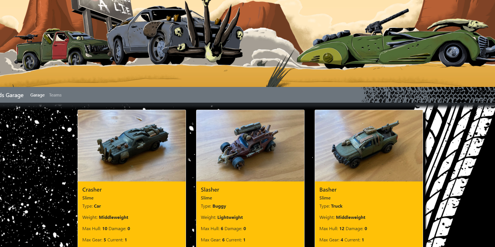

# gaslands_garage_express
# Turnpike Tussle

## Description
    
This is an express application used to build and modify teams for the table top racing game Gas Lands.

## Table of Contents
1. [Installation](#installation)
1. [Usage](#usage)
1. [License](#license)
1. [Contributing](#contributing)
1. [Tests](#tests)
1. [Questions](#questions)

## installation
    
Currently working on building front end to use as template for handlebars after the back end is functioning
    
## Usage
    
Ultimate goal is to have an app where you can create custom racing teams viable for play with the gaslands refuled table top game.
    
## License
    
MIT
    
## Contributing
    
App designed based on the rules of Gaslands Refuled created by Mike Hutchinson
    
## Tests
    
Coming Soon
    
## Questions

Github: insideseandhead
email: seanmorgandesigns@gmail.com